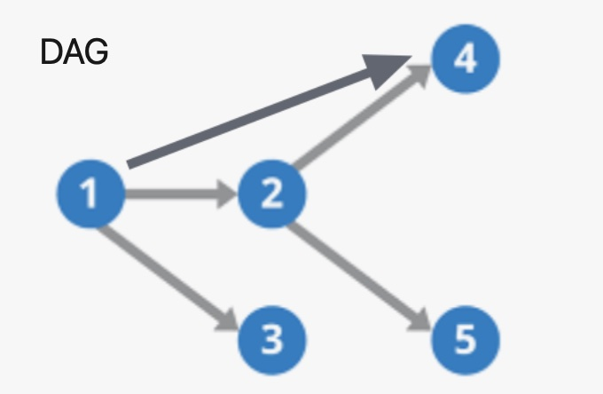

# hertzer

1. a gin webserver which bases on [cloudwebgo/hertz](http://github.com/cloudwego/hertz)
2. inspired by [cobra](https://github.com/spf13/cobra) for the RouterGroup management


## 1. Usage

go to [example/demo](./__example__/main.go)

```go
go get -u github.com/go-jarvis/hertzer
```

## 2. Server

```go
func main() {

// define a server
	s := &hertzer.Server{
		Listen: ":8081",
	}

// set server options, sam eas hertz
	s.WithOptions(
		server.WithBasePath("/api"),
		server.WithIdleTimeout(10),
	)

// add middlewares, same as the hertz
	s.Use(prefunc(), postfunc())

// handle a router handler
	s.Handle(&Ping{})

// Run server
	if err := s.Run(); err != nil {
		panic(err)
	}
}
```

## 3. Router Handler

Main Router HandlerFunc

```go
type Ping struct {
	httpx.MethodPost `route:"/ping/:name"` // define method and path

// define the body
	Name      string  `path:"name"`
	Age       int     `query:"age"`
	AuthToken string  `header:"AuthToken"`
	Address   Address `json:"address"`
	Score     int     `json:"score" form:"score"`
}


// Handle method must exists.
// reqeust data will be binded into p automaticly.
// it can be used directly.
func (p *Ping) Handle(ctx context.Context, arc *app.RequestContext) (any, error) {

	fmt.Println(p.Address)

	ret := resp.NewStatusResponse(consts.StatusAccepted, *p)
	return ret, nil
}
```

So that, the default handler will be like:

```go
// r.Handle(httpMethod, relativePath string, handlers ...app.HandlerFunc)
r.Handle("POST","/ping/:name", handler)
```

### 3.1. Hanlder's HandlerFuncChain

Add the `PreHandlers` and `PostHandlers` to combine the HandlerFunc Chain.  NOTE: `PreHandlers` and `PostHandlers` as **optional**.

```go
func (Ping) PreHandlers() []app.HandlerFunc {
	return []app.HandlerFunc{
		prefunc(),
	}
}

func (Ping) PostHandlers() []app.HandlerFunc {
	return []app.HandlerFunc{
		postfunc(),
	}
}
```

The Registered Router will be like

```go
// r.Handle(httpMethod, relativePath string, handlers ...app.HandlerFunc)
r.Handle("POST","/ping/:name", [pre...,] handler, [post...])
```

### 3.2 RouterGroup

As metioned before, the RouterGroups like the carriages of a train. They are not only mounted one by one, and but also can be mounted to any RouterGroup.

**NOTE**:  The **Mounted Ring** is **forbidden**. And `Directed Acyclic Graph(DAG)` of RouterGroups are required.



1. Using `v1:=hertzer.NewRouterGroup(v1)` to create a new RouterGroup
2. Using `v2.AddGroup(v2)` to add children RouterGroup(s).

```go
// define a server
	s := &hertzer.Server{
		Listen: ":8081",
	}

// define Router Groups
	v1 := hertzer.NewRouterGroup("/v1")
	v1.Handle(&Ping{})

	v2 := hertzer.NewRouterGroup("/v2")

// mount children RouterGroup(s)
	s.AddGroup(v1)
	v1.AddGroup(v2)
	s.AddGroup(v2)

```

## 4. Response and Error

By default,

```go
func (p *Ping) Handle(...) (result any, err error) {}
```

Typically, the response will be

1. if the error is nil:
    + status code = 200 // http.StatusOK
    + the data is "`result`"

2. if the error is not nil:
    + status code = 500 // http.StatusInternalServerError
    + the data is "`err.Error()`"

the `3rd` response is special, Router Binding error.
    + status code = 400 // StatusBadRequest
    + the data is actual value of `binding error`

### 4.1. Status Reponse

However, you may use `resp.NewStatusResponse` to set the HTTP Status Code whatever you need.

```go
// define
func NewStatusResponse(code int, meta interface{}) StatusResponse {
	return &statusResponse{
		code: code,
		meta: meta,
	}
}

// usage
ret := resp.NewStatusResponse(consts.StatusBadGateway, *p)
return ret, nil
```

### 4.2. Status Error

By the way, you can use `errors.New` to create a status error.

```go
// define
func New(err error, meta any) *StatusError {
	return &StatusError{
		Err:  err,
		Meta: meta,
		Message: "",
	}
}

// usage
serr := errors.New(err, *p)
serr = serr.SetMessage("Error Message")
```

By default the `Message` will be the HTTP Status Message/Define if you don't `SetMessage`


## Wallaby.js

[](https://wallabyjs.com/oss/)

This repository contributors are welcome to use
[Wallaby.js OSS License](https://wallabyjs.com/oss/) to get
test results immediately as you type, and see the results in
your editor right next to your code.
